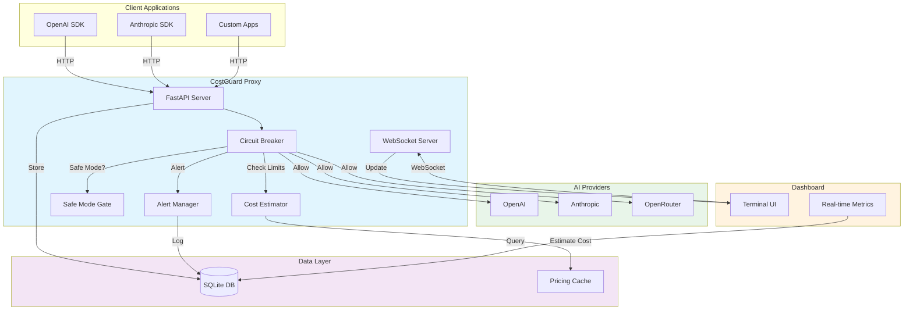

# CostGuard — Real-Time AI Spend Circuit Breaker

> Made Autonomously Using **NEO** — Your Autonomous AI Engineering Agent
> [https://heyneo.com](https://heyneo.com)

A production-ready local proxy that enforces hard spending limits before AI API requests are sent. CostGuard acts as a protective layer between your applications and AI providers (OpenAI, Anthropic, OpenRouter), ensuring you never exceed your budget.

## Features

- 🔒 **Hard Circuit Breakers**: Per-session, per-hour, per-day, and per-project spending limits
- 💰 **Real-Time Cost Estimation**: Pre-call cost calculation using tiktoken
- 🛡️ **Safe Mode**: Require explicit confirmation for expensive requests
- 📊 **Real-Time Dashboard**: Terminal-based dashboard with WebSocket updates
- 🔔 **Multi-Channel Alerts**: Console, webhook, and file-based alerting
- 🔌 **OpenAI-Compatible API**: Drop-in replacement for OpenAI SDK
- 🗄️ **Local SQLite**: All data stays on your machine
- ⚡ **Async Architecture**: High-performance concurrent request handling

## Architecture

## Quick Start

### Installation

Clone the repository, create and activate a virtual environment, and run `pip install -e ".[dev]"`.

### Configuration

Copy `.env.example` to `.env`, then add at least one provider key and any optional budget overrides such as session, hour, day, project, or safe-mode thresholds.

### Running the Server

Start the proxy with `costguard server`, or run `uvicorn costguard.server:create_app --factory --reload --port 8000` if you prefer uvicorn directly.

### Using the Proxy

Configure your OpenAI SDK to use CostGuard:
Point your OpenAI SDK at `http://localhost:8000/v1`, keep the provider API key in the client, and send the usual chat-completions request with session and project headers.

### Real-Time Dashboard

Run `costguard dashboard` in a separate terminal, or set `COSTGUARD_SESSION_ID=my-session` before launching it.

## API Endpoints

### OpenAI-Compatible Endpoints

- `POST /v1/chat/completions` - Chat completions with cost tracking
- `GET /v1/models` - List available models with pricing

### CostGuard-Specific Endpoints

- `POST /v1/estimate` - Get cost estimate without making request
- `GET /v1/status/{session_id}` - Get circuit breaker status
- `POST /v1/safe-mode/confirm` - Confirm safe mode request
- `GET /health` - Health check

### WebSocket

- `WS /v1/dashboard/ws` - Real-time dashboard updates

## Supported Models (April 2026)

### OpenAI
- GPT-4.1
- GPT-4.1 Mini
- GPT-4.1 Nano
- GPT-4o ($2.50/$10.00 per MTok)
- GPT-4o Mini ($0.15/$0.60 per MTok)

### Anthropic
- Claude Opus 4 (`claude-opus-4-20250514`)
- Claude Sonnet 4 (`claude-sonnet-4-20250514`)
- Claude 3.7 Sonnet (`claude-3-7-sonnet-20250219`)

### OpenRouter
All OpenAI and Anthropic models available with 5.5% platform fee.

## Circuit Breaker Behavior

Limits are evaluated in this deterministic order:

1. **Session Limit** - Most restrictive, resets on new session
2. **Hour Limit** - Rolling 1-hour window
3. **Day Limit** - Resets at midnight UTC
4. **Project Limit** - Least restrictive, tracks all-time project spend

When any limit is exceeded:
- Request is blocked with structured error
- Alert is fired immediately
- Circuit breaker status changes to OPEN
- Subsequent requests are blocked until limit resets

## Safe Mode

When a request's estimated cost exceeds `COSTGUARD_SAFE_MODE_THRESHOLD`:

1. Request is paused
2. Alert is sent to configured channels
3. Confirm the request with `POST /v1/safe-mode/confirm`.
4. Original request proceeds if confirmed

## Development

### Running Tests

Run `pytest` for the full suite, `pytest --cov=costguard --cov-report=html` for coverage, or target `tests/test_circuit_breaker.py` for a focused run.

### Code Quality

Use `ruff format src tests` for formatting, `ruff check src tests` for linting, `mypy src/costguard` for type checking, and `ruff format --check src tests && ruff check src tests && mypy src/costguard` for the full quality gate.

### Project Structure

Core layout: `src/costguard/` contains the models, database, pricing, circuit breaker, safe mode, alerts, server, and dashboard modules; `tests/` holds the suite; `config/` stores tooling settings; `pyproject.toml` defines dependencies; `.env.example` captures configuration; and `README.md` is this guide.

## Configuration Reference

| Variable | Default | Description |
|----------|---------|-------------|
| `COSTGUARD_SESSION_LIMIT` | 10.00 | Max spend per session (USD) |
| `COSTGUARD_HOUR_LIMIT` | 50.00 | Max spend per hour (USD) |
| `COSTGUARD_DAY_LIMIT` | 200.00 | Max spend per day (USD) |
| `COSTGUARD_PROJECT_LIMIT` | 1000.00 | Max spend per project (USD) |
| `COSTGUARD_SAFE_MODE_THRESHOLD` | 5.00 | Safe mode trigger (USD) |
| `COSTGUARD_ALERT_CHANNELS` | console | Comma-separated: console,webhook,file |
| `COSTGUARD_WEBHOOK_URL` | None | Webhook URL for alerts |
| `COSTGUARD_DB_PATH` | ~/.costguard/costguard.db | SQLite database path |
| `COSTGUARD_LOG_LEVEL` | INFO | Logging level |

## License

MIT License - see [LICENSE](LICENSE) file for details.

## Contributing

Contributions welcome! Please read our [Contributing Guide](CONTRIBUTING.md) for details.

## Support

- 📖 [Documentation](https://costguard.readthedocs.io)
- 🐛 [Issue Tracker](https://github.com/yourusername/costguard/issues)
- 💬 [Discussions](https://github.com/yourusername/costguard/discussions)

## Project Overview

CostGuard is a local circuit-breaker proxy for AI spend control. It enforces session/hour/day/project limits, estimates cost preflight, and blocks runaway usage before billing damage occurs.

## Prerequisites

- Python 3.10+
- `pip`
- At least one provider API key (OpenAI/Anthropic/OpenRouter)

## Usage

Start proxy: `costguard server`, then point clients to `http://localhost:8000/v1`. Use `costguard estimate` for pre-call cost checks and `costguard status` for active budget state.

## API Reference

OpenAI-compatible endpoints: `POST /v1/chat/completions`, `GET /v1/models`. CostGuard endpoints: `POST /v1/estimate`, `GET /v1/status/{session_id}`, `POST /v1/safe-mode/confirm`, `GET /health`, `WS /v1/dashboard/ws`.

## Models Used

CostGuard uses provider pricing tables and runtime model IDs (OpenAI, Anthropic, OpenRouter catalogs). No embedded training/inference model is required in-process.

## Testing

Run `ruff check src tests`, `mypy src/costguard`, and `pytest`.
